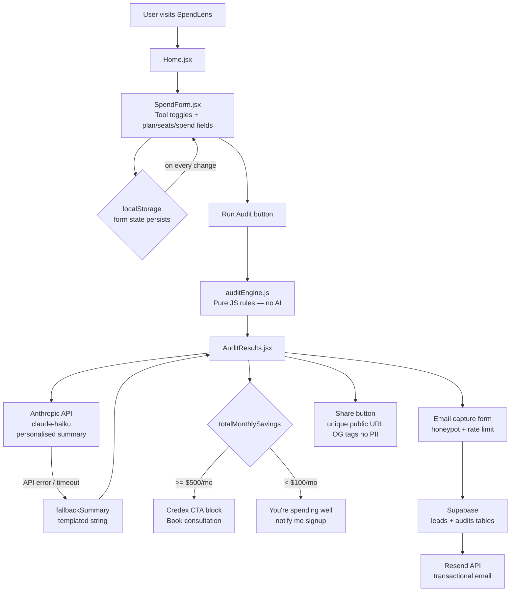

# ARCHITECTURE.md — SpendLens (AI Spend Audit Tool)

## What This Is

SpendLens is a free React web app that audits a startup's AI tool spending.
A user inputs their AI subscriptions (Cursor, Claude, ChatGPT, etc.) and gets
an instant breakdown of overspend, recommended actions, and total savings — no login required.

---

## System Diagram



---

## Data Flow: Input to Audit Result

```
1. USER FILLS FORM  (SpendForm.jsx + ToolRow.jsx)
   └─ Toggles tool active/inactive
   └─ Selects: plan, seats, monthly spend
   └─ Selects: team size, primary use case
   └─ Every change → localStorage via useEffect in Home.jsx

2. USER CLICKS RUN AUDIT  (Home.jsx → handleRun)
   └─ Filters entries to active only
   └─ Calls runAudit(activeEntries, context) in auditEngine.js
   └─ Per tool: applyRules() → { action, recommendedCost, reason, status }
   └─ savings = max(0, currentCost − recommendedCost)
   └─ Returns: { results[], totalMonthlySavings, totalAnnualSavings }

3. AI SUMMARY  (Home.jsx → generateSummary)
   └─ POST to Anthropic API (claude-haiku) targeting ~100 words
   └─ On ANY error → fallbackSummary() template string (always works)

4. RESULTS RENDERED  (AuditResults.jsx)
   └─ Savings hero card, per-tool AuditItem cards, AI summary
   └─ savings >= $500 → Credex CTA | savings < $100 → optimal message
   └─ Email form shown after value, never before

5. LEAD CAPTURE  (supabase.js)
   └─ saveAudit() + saveLead() on email submit
   └─ Supabase webhook → Resend transactional email

6. SHAREABLE URL
   └─ Unique UUID per audit — strips email/name, shows tools + savings
   └─ OG meta tags via React Helmet
```

---

## File Structure

```
ai-spend-audit/
├── src/
│   ├── App.jsx                  ← Root: Navbar + routing
│   ├── index.css                ← CSS variables, base styles, animations
│   ├── components/
|   |   ├──shared/
│   │   |   ├── Navbar.jsx           ← Sticky nav
│   │   |   ├── SpendForm.jsx        ← Left panel: tool list + run button
│   │   |   ├── ToolRow.jsx          ← Single tool: toggle + plan/seats/spend
│   │   |   └── AuditResults.jsx     ← Right panel: savings, cards, email gate
|   |   ├──ui/
|   |   |   ├──Button.jsx            ← Reusable Button Component
|   |   |   └──Icon.jsx              ← Reusable Icon Component
│   ├── pages/
│   │   └── Hero.jsx             ← Headline + stats strip
|   |   ├── Audit.jsx            ← Main panel: Left panel + Right Panel
│   ├── engine/
│   │   └── auditEngine.js       ← Pure JS audit rules
│   ├── data/
│   │   └── pricingData.js       ← Vendor pricing as JS objects
│   └── lib/
│       └── supabase.js          ← saveLead(), saveAudit()
├── .github/workflows/ci.yml    ← ESLint + Jest on push to main
└── [all required .md files]
```

---

## Why This Stack

| Decision | Choice | Reason |
|---|---|---|
| Framework | React (plain JS) | Assignment allows React explicitly. 7-day sprint — learning Next.js would consume 2–3 days of feature time. Deploys to Vercel in one click. |
| Language | JavaScript | Chose JS over TypeScript — more confident in it,
avoided slowing down a 7-day sprint with unfamiliar tooling.A complete working JS app beats a half-finished TS one.Will migrate in week 2 if shortlisted. JSDoc on all exports. |
| Styling | CSS variables + Tailwind | Design tokens in index.css (var(--green), var(--r-md)) keep the design consistent without className noise. |
| State | useState + localStorage | No Redux needed — state lives in Home.jsx and flows down as props. Persistence is one useEffect line. |
| Database | Supabase | Free tier, Postgres, Row Level Security, Database Webhooks to Resend — no custom backend server needed. |
| Email | Resend | Simplest transactional email API. Free tier covers early traffic. Triggered via Supabase webhook. |
| AI summary | Anthropic API (claude-haiku) | Fast (~1s), cheap, perfect for 100 words. Hardcoded fallback means UI never breaks if API is down. |
| Deploy | Vercel | GitHub integration, preview URLs per PR, env vars in dashboard. |

---

## Audit Engine — Why No AI

auditEngine.js is pure JavaScript rules. AI is intentionally not used here.

The assignment states: "knowing when not to use AI is part of the test."

Hardcoded rules are deterministic, auditable, fast, and unit-testable.
Each ruleXxx() function is pure — same inputs always give the same output.
A finance person can read the file and verify every recommendation.

AI is used only for the personalised summary — where natural language
generation adds real value and a wrong answer has no financial consequences.

---

## Abuse Protection

| Layer | Mechanism |
|---|---|
| Email form | Honeypot hidden field — bots fill it, humans don't, zero UX friction |
| Supabase | Rate limit 10 inserts/IP/hour via Edge Function |
| API key | Anthropic key proxied through Supabase Edge Function in production — never in client bundle |

---

## Scaling to 10,000 Audits/Day

| Problem | Solution |
|---|---|
| Supabase free tier connection limit | Upgrade + PgBouncer connection pooling |
| Anthropic rate limits | Queue summary async via pg_cron, show skeleton UI |
| Pricing data going stale | GitHub Action runs weekly, opens PR if prices changed |
| Vercel cold starts | Migrate heavy functions to Cloudflare Workers |
| No observability | PostHog: form_started, audit_run, email_captured, credex_cta_clicked |

---

## Framework Justification

React with plain JavaScript was chosen over Next.js + TypeScript.
The assignment allows React explicitly. Given the 7-day constraint,
learning Next.js mid-sprint would have cost 2–3 days of feature
development. TypeScript would add correctness but at the cost of
shipping speed for someone not yet fluent in it. This is a deliberate
trade-off documented here per the assignment requirement.

## Key Constraints

- No secrets in repo — .env locally, Vercel dashboard in production
- Form state persists across reloads (localStorage)
- Email captured after value shown, never before
- API failure handled gracefully (fallback summary always works)
- Public share URL strips PII — shows tools + savings only
- Honeypot on email form